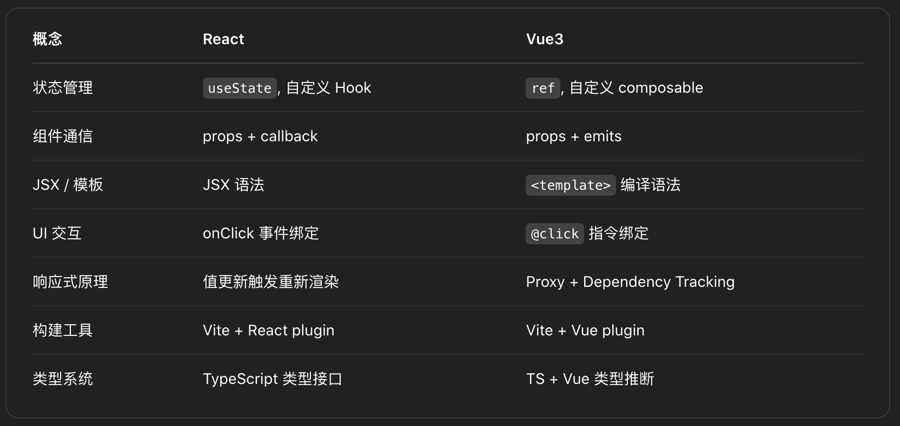
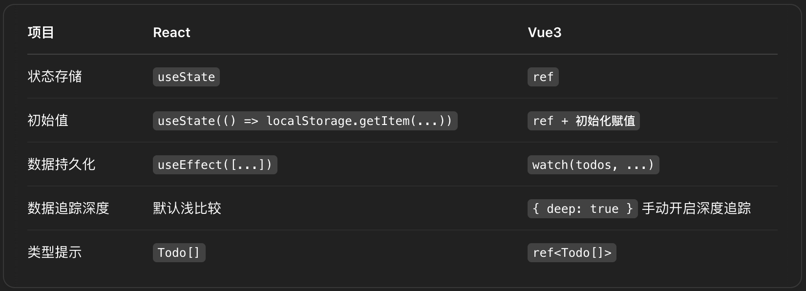
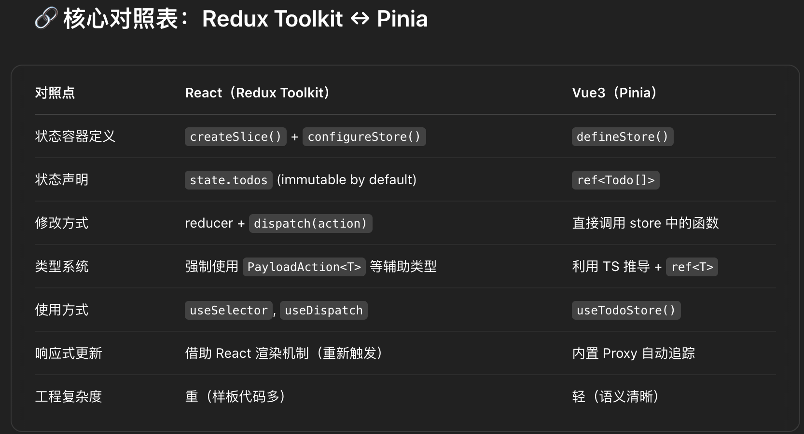
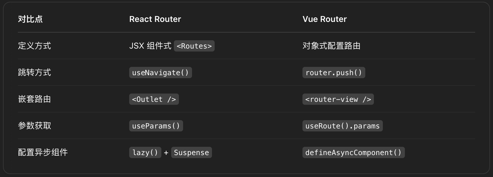
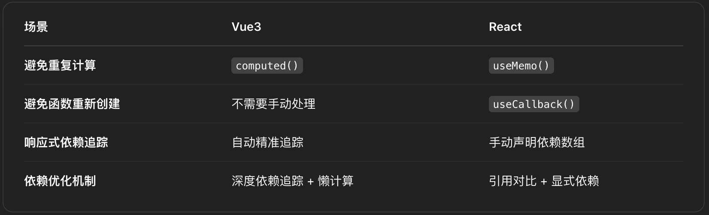

# Learn VueJs by compare with ReactJs (TodoApp)

## Branches of step

### step1-usestate

数据状态变化：useState vs ref, reactive

### step2-useeffect

数据变化后的副作用处理：useEffect vs watch

### step3-redux

状态管理对比：Redux Toolkit vs Pinia

### step4-router

路由对比：React Router vs Vue Router

### step5-usememo

性能优化对比 —— computed vs useMemo/useCallback

## React vs Vue

- pass props -> pass props
- pass function and callback -> pass function and emit
- useState -> ref, reactive (only for complex object)
- useEffect -> watch
- hooks -> Composable API
- Redux Toolkit -> Pinia (pinia is really concise)

## 核心差异

React & Vue 的核心差异在于对待数据的方式: JSON vs Object

React: 不可变数据 + Virtual DOM + Fiber 调度

Vue: 依赖追踪 + 精准组件更新 + 基于 Proxy 的响应式系统 (JavaScript Object 自身的特性)

## Fix build error

- Tailwind CSS v3
- use tailwind.config.mjs not .js
