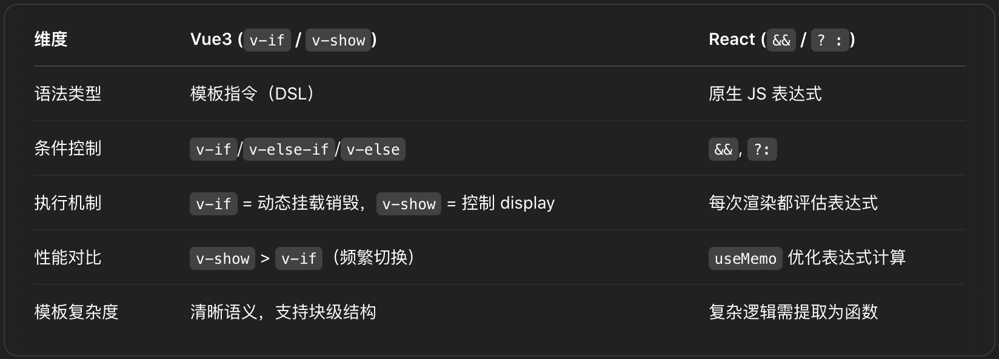
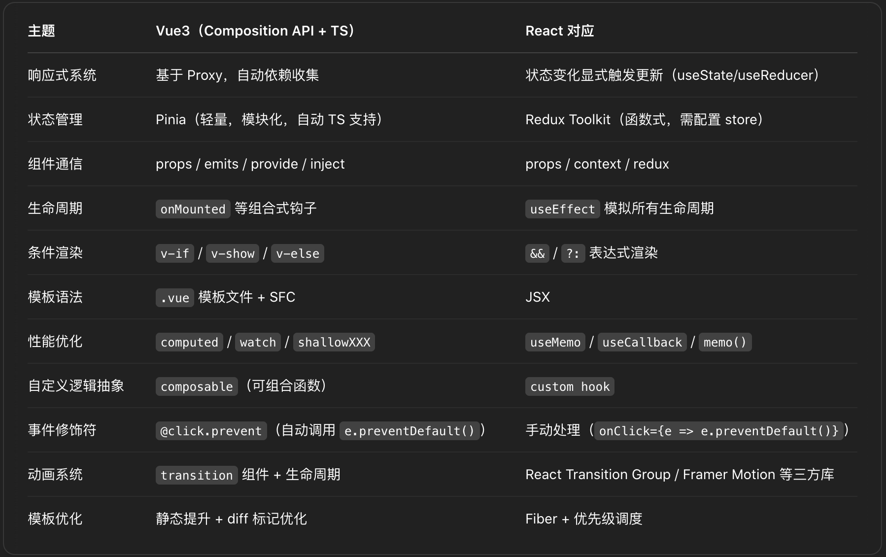
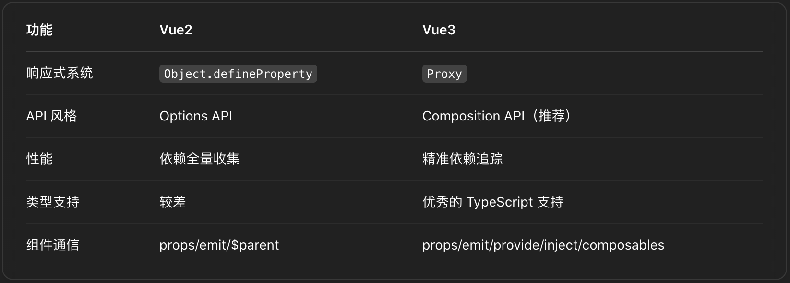

# Learn VueJs by compare with ReactJs (TodoApp)

## Branches of steps (git checkout step1-usestate)

### step1-usestate

数据状态变化：useState vs ref, reactive

### step2-useeffect

数据变化后的副作用处理：useEffect vs watch

### step3-redux

状态管理对比：Redux Toolkit vs Pinia

### step4-router

路由对比：React Router vs Vue Router

### step5-usememo

性能优化对比 —— computed vs useMemo/useCallback

### step6-template

模板渲染差异 —— v-if vs && / 三元表达式

## 核心差异

React & Vue 的核心差异在于对待数据的方式: **JSON vs Object**

React: 不可变数据 + Virtual DOM + Fiber 调度

Vue: 依赖追踪 + 精准组件更新 + 基于 Proxy 的响应式系统 (JavaScript Object 自身的特性)

**对比表（Vue3 vs React**

**对比表（Vue3 vs Vue2**

## Fix build error

- Tailwind CSS v3
- use tailwind.config.mjs not .js
